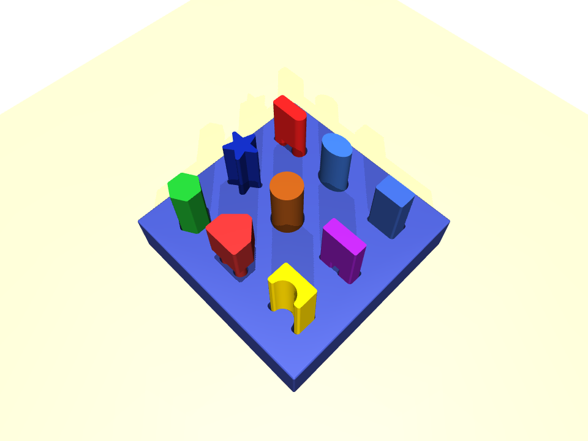
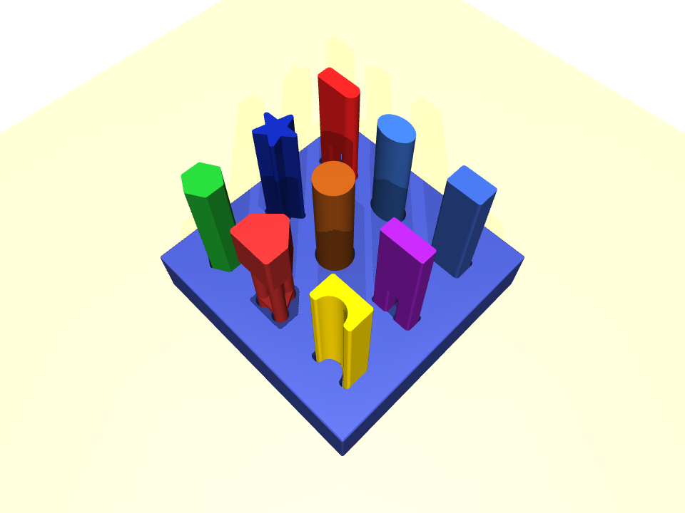
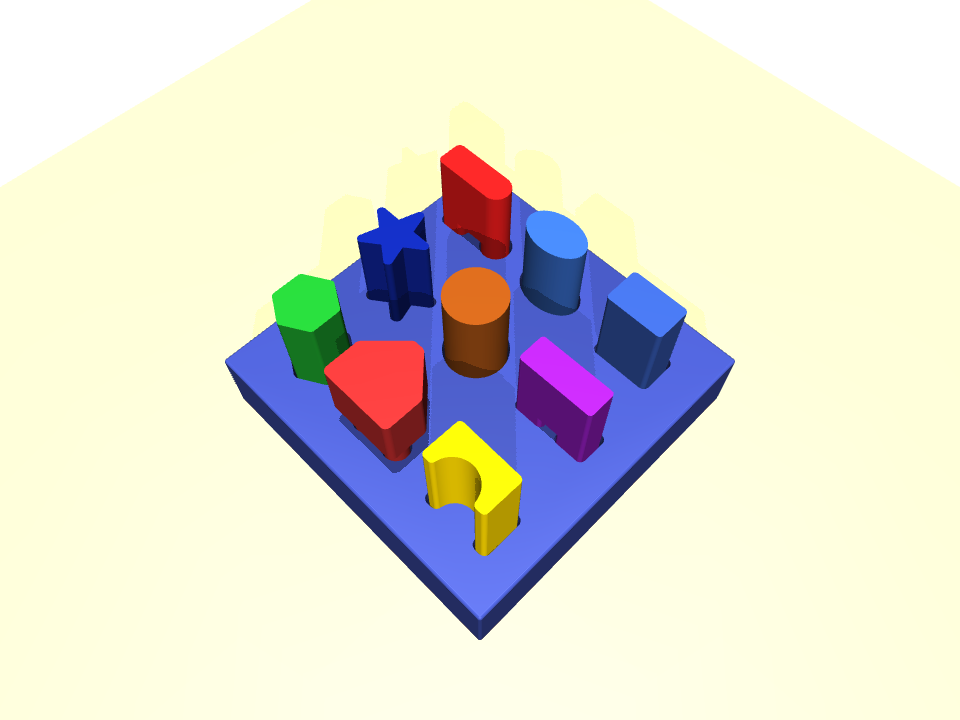
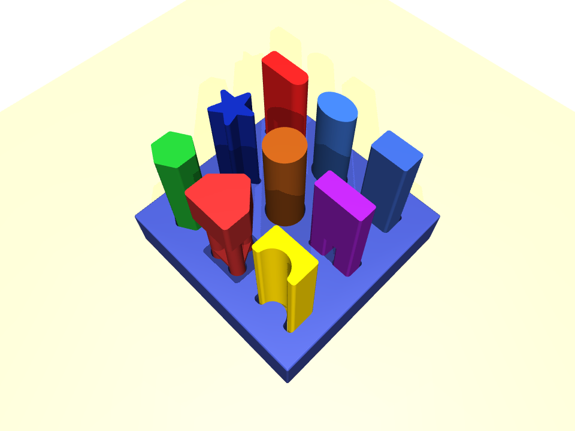
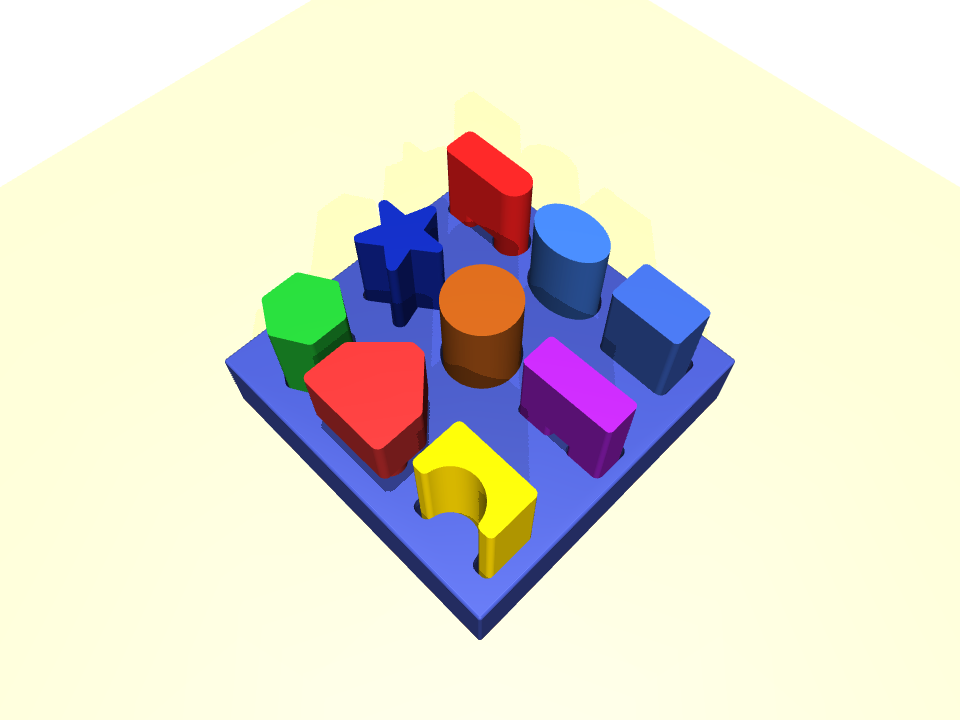
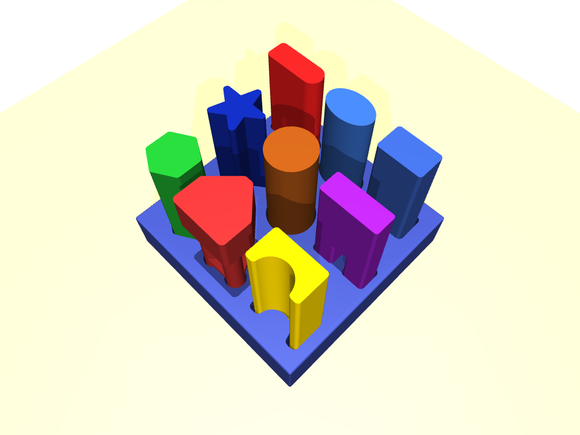
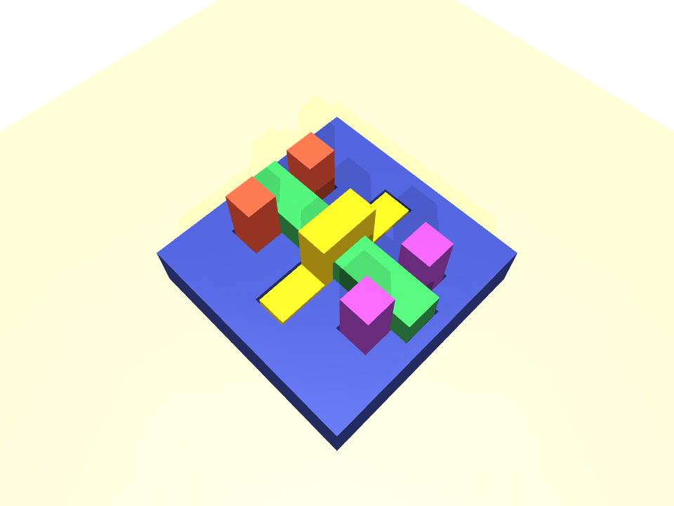
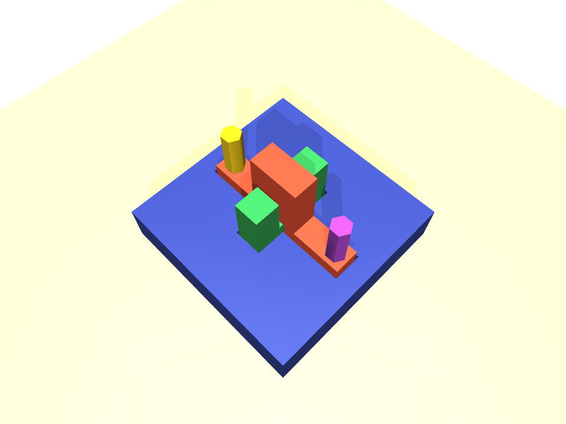
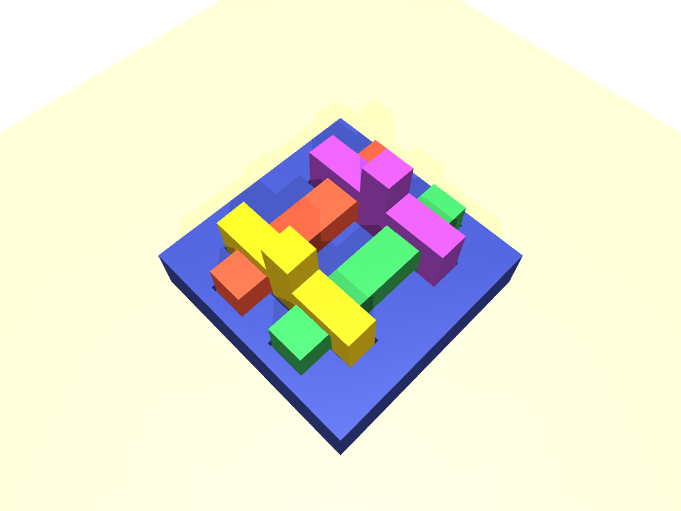
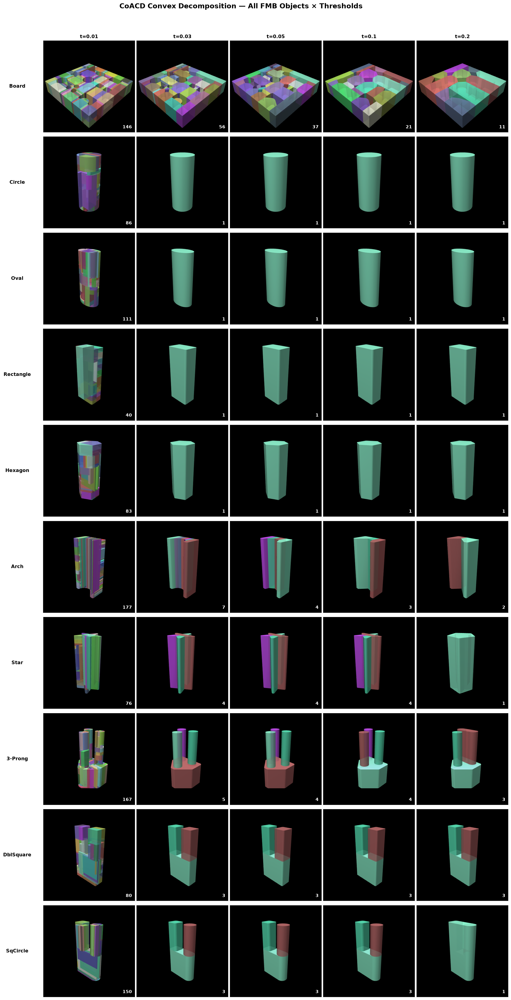

# fmb-mujoco

[FMB (Functional Manipulation Benchmark)](https://functional-manipulation-benchmark.github.io/) objects in MuJoCo.

**Videos & renders:** [joonhyung-lee.github.io/fmb-mujoco](https://joonhyung-lee.github.io/fmb-mujoco/) (gh-pages branch)

## Quick start

```bash
uv sync
uv run python notebook/view_scene.py                     # default: M/short
uv run python notebook/view_scene.py scene_single_L_long # pick any scene below
```

## Single-Object Scenes (peg-in-hole)

9 shapes × 3 sizes (S/M/L) × 2 lengths (short/long) = **54 pegs**, each matched to a hole board.

| | **short** (100mm) | **long** (150mm) |
|:-:|:-:|:-:|
| **S** |  |  |
| | `scene_single_S_short` | `scene_single_S_long` |
| **M** |  |  |
| | `scene_single_M_short` | `scene_single_M_long` |
| **L** |  |  |
| | `scene_single_L_short` | `scene_single_L_long` |

```bash
uv run python notebook/view_scene.py scene_single_{S,M,L}_{short,long}
```

## Multi-Object Scenes (interlocking assembly)

3 assembly sets, each with a base plate + 4 interlocking parts.

| **Assembly 1** | **Assembly 2** | **Assembly 3** |
|:-:|:-:|:-:|
|  |  |  |
| `scene_multi_1` | `scene_multi_2` | `scene_multi_3` |

```bash
uv run python notebook/view_scene.py scene_multi_{1,2,3}
```

## Collision mesh decomposition

Convex decomposition via [CoACD](https://github.com/SarahWeiii/CoACD) (`obj2mjcf --decompose`).



| Object type | CoACD threshold | Hulls |
|-------------|:-:|:-:|
| Convex pegs (circle, oval, rectangle, hexagon) | 0.2 | 1 |
| Concave pegs (arch, star, 3prong, doublesquare, squarecircle) | 0.1 | 1–7 |
| Hole boards | 0.01 | 129–144 |
| Assembly bases | 0.01 | 53–109 |

Single-scene board collision is hybrid: CoACD hulls that plug a hole region are
dropped (holes measured from the mesh cross-section) and replaced with invisible
primitive walls, so pegs can actually insert.

## Mesh regeneration

```bash
uv run python asset/extract_meshes.py    # STEP → OBJ (54 pegs + boards + assemblies)
uv run python asset/build_scenes.py      # regenerate scene XMLs + baked "aligned" keyframes
```

STEP source files from [FMB website](https://functional-manipulation-benchmark.github.io/files/index.html). Solid-index mapping from [fmb-isaaclab](https://github.com/johnMinelli/fmb-isaaclab).

## Structure

```
asset/
  scene_single_{S,M,L}_{short,long}.xml   # 6 single-object scenes
  scene_multi_{1,2,3}.xml                  # 3 multi-object scenes
  extract_meshes.py
  build_scenes.py                          # scene generator (hybrid collision + aligned keyframes)
  step/                                    # FMB CAD source files (.step)
  obj/
    peg_{shape}_{S,M,L}_{short,long}/      # 54 peg dirs (visual + collision .obj)
    hole_board_{1,2,3}/                    # 3 hole boards
    board_{1,2,3}/                         # 3 multi-object assemblies
notebook/
  view_scene.py
```
